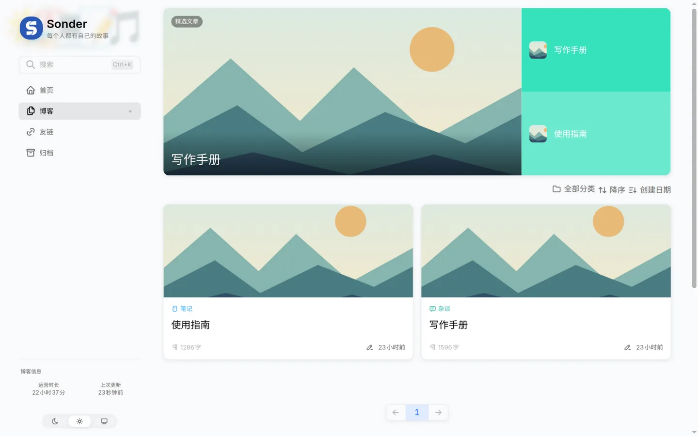
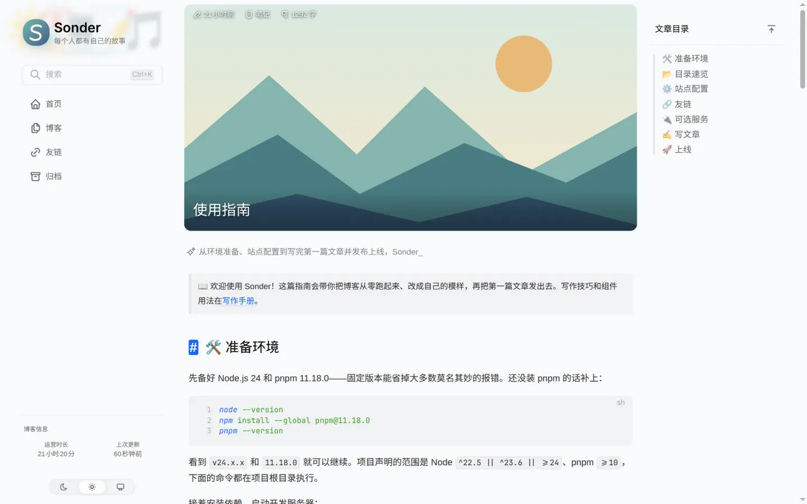
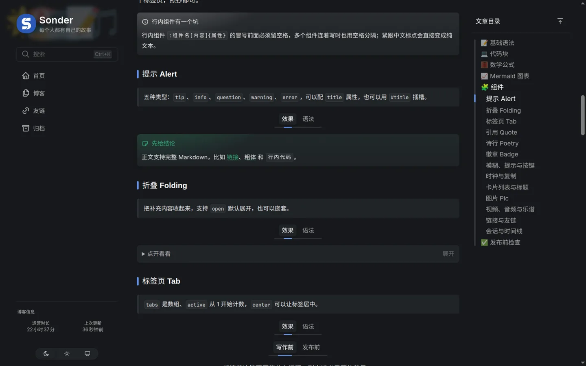

<div align="center">

# Sonder

**用文字记录生活，用代码分享想法**


</div>

---

📖 README：**简体中文** | [English](./README.en.md)

🔗 项目地址：[github.com/lmb666666/Sonder](https://github.com/lmb666666/Sonder)

- ⚡ **Nuxt 4 + Vue 3 + TypeScript**：静态生成和服务端渲染都能跑
- ✍️ **两种文章版式**：`tech` 技术排版，`story` 居中的故事排版
- 🎨 **改配置就能用**：站点身份、主页、导航、分类、主题都集中在 `blog.config.ts`
- 📚 **内容工具齐全**：全文搜索、归档、友链、Atom 订阅、代码高亮、KaTeX、Mermaid、乐谱

<table width="100%" align="center">
  <tr>
    <td align="center">
      
      <br>个人主页</td>
  </tr>
  <tr>
    <td align="center"><br>文章列表</td>
    <td align="center"><br>使用指南</td>
  </tr>
  <tr>
    <td colspan="2" align="center"><br>写作手册（暗色）</td>
  </tr>
</table>

> [!TIP]
>
> Sonder 是基于 [Clarity / blog-v3](https://github.com/L33Z22L11/blog-v3) 二次开发的个人博客模板，默认配置就能构建通过，适合拿来写自己的博客，也适合当 Nuxt Content 的参考项目。
>
> **参考了 Sonder 的组件设计或代码，请在项目里注明来源。**
>
> 英文 README 是中文版的对照翻译；项目本身没有多语言界面，`language` 只影响站点语言和 SEO 元数据。

## ✨ 功能特性

### 内容与写作

- [x] Nuxt Content 3 + Markdown/MDC，Front Matter 声明文章元信息
- [x] `tech` / `story` 两种版式，封面、分类、标签、目录、阅读时长、上下篇
- [x] 数字 `recommend` 一键进首页推荐轮播
- [x] MDC 组件箱：Alert、Folding、Tab、Pic、LinkCard、Poetry、Timeline、Chat 等
- [x] 代码高亮（折叠、缩进参考线、差异标记）、KaTeX 公式、Mermaid 图表、abcjs 乐谱

### 站点

- [x] 个人主页：hero、资料、生涯经历、技能、社交链接、赞助
- [x] 全文搜索（MiniSearch + 中文分词）、归档、分类筛选、友链
- [x] Atom 订阅、OPML 导出、sitemap、robots、llms.txt
- [x] 亮色 / 暗色 / 跟随系统主题，响应式布局
- [x] 可选服务：Twikoo 评论、Ech0 动态、Friend-Circle-Lite 朋友圈、Meting 音乐解析

## 🚀 快速开始

### 环境要求

- Node.js `^22.5 || ^23.6 || >=24`，推荐 24
- pnpm `>=10`，复现安装用 11.18.0

### 本地开发

```sh
git clone https://github.com/lmb666666/Sonder.git
cd Sonder
pnpm install --frozen-lockfile
pnpm exec nuxt dev --host 127.0.0.1
```

浏览器打开终端给出的地址，默认是 `http://127.0.0.1:3000`。

安装时会执行 `prepare`：清理 `.data` 和依赖缓存，然后运行 `nuxt prepare`。`pnpm-workspace.yaml`、锁文件和 `patches/` 都要保留；冻结安装失败时先核对 Node/pnpm 版本，不要直接删锁文件。想自动打开浏览器可以用 `pnpm dev`。

### 第一次配置

模板默认写着占位信息（站点名 Sonder、作者 Your Name、域名 example.com），部署前至少改这几处：

1. `blog.config.ts` 顶部的 `basicConfig`：标题、副标题、作者、邮箱、`url`（完整地址，不带末尾斜杠）
2. `home` 区块：主页问候语、简介、生涯经历、技能、社交链接
3. `article.categories`：分类名和图标，文章里用到的分类必须在这里存在

改完跑一遍配置审计：

```sh
pnpm audit:config
```

## 📖 配置说明

日常只需要改 `blog.config.ts`，其余配置文件是围着它转的：

| 文件 | 用途 |
| --- | --- |
| `blog.config.ts` | 站点身份、页面、功能开关、主页、外观——日常定制入口 |
| `shared/types/blog-config.ts` | 配置字段和允许值的类型定义 |
| `nuxt.config.ts` | 模块、内容插件、SEO、路由、图片、构建设置 |
| `content.config.ts` | 内容集合与 Front Matter schema |
| `content/data/friend-feeds.ts` | 友链分组与条目；`app/feeds.ts` 会自动合并本站信息 |
| `redirects.json` | 旧地址到新地址的 308 重定向 |
| `app/assets/css/`、`app/shiki.config.ts` | 全局样式、字体栈与代码高亮主题 |

`blog.config.ts` 里的主干区块：

| 区块 | 干什么的 |
| --- | --- |
| `basicConfig` | 站点标题、描述、作者、版权、favicon、语言、时区、网址 |
| `article` | 分类的图标与颜色、永久链接前缀 |
| `seo` | 不收录路径、反镜像域名黑名单 |
| `features` | 评论、动态、朋友圈、音乐的开关与服务地址（默认关闭） |
| `feed` | Atom 订阅开关、条数上限、XSLT 样式 |
| `home` | 首页模式（个人主页 / 文章列表）与各区块内容 |
| `nav`、`footer`、`header` | 侧边栏、页脚导航、标题栏设置 |
| `pages` | 首页 / 博客 / 友链 / 归档页的开关与文案 |
| `theme`、`ui` | 默认主题、侧边栏、代码块、轮播、提示框等外观参数 |
| `pagination`、`generator`、`scripts` | 分页、文章生成脚本、全站第三方脚本 |

每个字段的说明都写在 `blog.config.ts` 的注释里，改配置时直接看那里就行。改了配置类型记得同步 `shared/types/blog-config.ts` 和配置审计。

## 🔌 可选服务

评论、动态、朋友圈和歌曲解析默认关闭，依赖独立部署的服务，准备好端点再逐项开启：

| 功能 | 上游项目 | 配置 |
| --- | --- | --- |
| 评论 | [Twikoo](https://github.com/imaegoo/twikoo) | `features.comments.enabled`、`twikoo.envId` |
| 动态 | [Ech0](https://github.com/lin-snow/Ech0) | `features.moments.enabled`、`apiUrl` |
| 朋友圈 | [Friend-Circle-Lite](https://github.com/willow-god/friend-circle-lite) | `features.circle.enabled`、`apiUrl` |
| 歌曲解析 | [Meting](https://github.com/metowolf/Meting) | `features.music.metingApis` |

Ech0 负责你自己的动态时间线，Friend-Circle-Lite 聚合友链站点的文章更新，都需要单独搭好后把地址填进 `apiUrl`。开启后页面会向对应端点发请求，KaTeX 样式也来自 CDN，所以关掉全部可选服务不等于零外部请求。

## ✍️ 写作

文章放在 `content/posts/`，可以按年份建子目录。创建新文章用交互式脚本：

```sh
pnpm new            # 按提示输入
pnpm new my-first-post
```

脚本会问分类、标签、版式，写入当前年份目录，生成随机 `postid`，最后尝试用 VS Code 打开文件。

### Front Matter

```yaml
---
title: 我的第一篇文章
description: 一句话说清这篇写了什么。
date: 2026-10-04
updated: 2026-10-04
postid: my-first-post
type: tech
categories: [笔记]
tags: [随笔]
draft: false
---
```

| 字段 | 说明 |
| --- | --- |
| `title`、`date`、`description` | 内容审计要求非空，日期格式 `2026-10-04` |
| `postid` | 文章唯一 ID，决定永久链接 `/posts/<postid>`，发布后不要改 |
| `type` | `tech` 技术版式（默认），`story` 故事版式 |
| `categories` | 必须是 `article.categories` 里配置过的名字 |
| `tags` | 字符串数组，自由填写 |
| `draft` | 布尔值；开发环境可以预览，生产构建会过滤掉，但别拿它当保密手段 |
| `image` | 封面；不填就用 `ui.article.fallbackCover` |
| `recommend` | 数字，进入首页推荐轮播，`0` 也算推荐 |
| `references` | `{ title, link }` 数组，显示在文末 |

要给已发布文章换 `postid`，记得在 `redirects.json` 里补一条旧地址到新地址的映射。

### Markdown 与 MDC

正文是标准 Markdown，另外提供一批 `::组件名{属性}` 形式的 MDC 组件：提示、折叠、标签页、引用、诗行、图片灯箱、链接卡片、时间线、会话、乐谱等。属性可以内联，也可以用 YAML 属性块，后者适合长内容：

```mdc
::alert{type="tip" title="提示"}
type 可选 tip / info / question / warning / error。
::

::pic
---
src: /images/cover.svg
caption: YAML 属性块适合写长属性
---
::
```

完整组件清单在 `app/components/content/`，用法、属性和效果都在站点上的[写作手册](./content/posts/writing.md)里演示了一遍。`Prose*` 系列负责 Markdown 元素的渲染，一般不用手动调用。

随模板的两篇示例文章：

| 示例文章 | 内容 |
| --- | --- |
| [使用指南](./content/posts/guide.md) | 环境、站点配置、友链、服务开关与发布流程 |
| [写作手册](./content/posts/writing.md) | 代码块、公式、图表与全部 MDC 组件 |

## 🚀 部署

### 静态站点（SSG）

```sh
pnpm generate
pnpm audit:dist
```

把 `.output/public/` 整个目录传到静态托管就行。平台需要支持 `/posts/<postid>/index.html` 这样的目录索引路由。域名和路径在生成时写死，换域名后要重新生成。

### Node 服务（SSR）

```sh
pnpm build
NITRO_HOST=127.0.0.1 NITRO_PORT=3000 node .output/server/index.mjs
```

保留完整的 `.output/`（含 `server/` 和 `public/`），用进程管理器常驻，前面挂反向代理提供 HTTPS。仓库里的 `edgeone.json` 是一份 EdgeOne 部署示例，其他平台按需自行配置。

## 🧞 常用命令

| 命令 | 作用 |
| --- | --- |
| `pnpm exec nuxt dev --host 127.0.0.1` | 本地开发，不自动打开浏览器 |
| `pnpm build` / `pnpm generate` / `pnpm preview` | SSR 构建 / SSG 生成 / 预览产物 |
| `pnpm new [名称]` | 交互式创建文章 |
| `pnpm lint` / `pnpm lint:fix` | ESLint + Stylelint 检查 / 修复 |
| `pnpm typecheck` / `pnpm test` | 类型检查 / Vitest 单元测试 |
| `pnpm audit:config` | 检查配置字段、允许值与重定向 |
| `pnpm audit:content` | 检查文章 Front Matter、分类、日期与唯一 ID |
| `pnpm audit:dist` | 检查生成产物：文章输出、订阅引用、草稿泄漏等 |
| `pnpm check:feed [查询]` | 检查友链订阅可用性（会发网络请求） |
| `pnpm generate-friend-json` | 从友链数据生成 `public/friend.json` |

发布前推荐跑完整流程：

```sh
pnpm audit:config && pnpm audit:content
pnpm lint && pnpm typecheck && pnpm test
pnpm generate && pnpm audit:dist
```

### 依赖补丁

`pnpm-workspace.yaml` 声明了 4 个补丁，安装时自动应用到依赖上：

| 补丁 | 作用 |
| --- | --- |
| `@nuxt/image` | 保留 1.5x 等浮点密度；IPX 改用 Web handler，避免静态预渲染阻塞 |
| `@nuxtjs/mdc` | 支持 TypeScript 内容插件、保留代码 Tab、行内代码传文本 |
| `@vue/shared` | 修正 `IsKeyValues` 类型的键范围与空值处理 |
| `plain-shiki` | 修正 CSS Highlight 选择器的后代空格 |

升级这些包之后要重新核对补丁是否还适用，不要靠删补丁来绕过安装报错。

## 🙏 致谢

博客架构和内容组件来自 [Zhilu](https://github.com/L33Z22L11) 的 [Clarity / blog-v3](https://github.com/L33Z22L11/blog-v3)，感谢原作者，Sonder 在此基础上继续维护和改造。

技术栈：[Nuxt](https://nuxt.com) · [Vue](https://vuejs.org) · [Nuxt Content](https://content.nuxt.com) · [Shiki](https://shiki.style) · [Iconify](https://iconify.design) · [KaTeX](https://katex.org) · [Mermaid](https://mermaid.js.org)

## 📄 许可协议

本项目遵循 [MIT license](./LICENSE)：你可以自由使用、修改、分发，保留下面的版权声明即可。仓库自带的示例文章和示例图片也按 MIT 处理；第三方依赖、图标与外部服务遵循各自许可。

**版权声明：**

- Copyright (c) 2024 [Zhilu](https://github.com/L33Z22L11) - [Clarity / blog-v3](https://github.com/L33Z22L11/blog-v3)
- Copyright (c) 2026-present [Liang](https://github.com/lmb666666) - [Sonder](https://github.com/lmb666666/Sonder)
