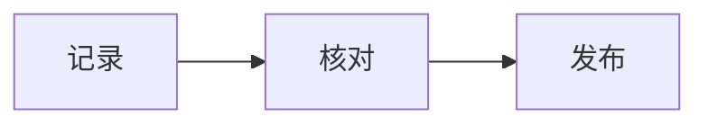

> 📝 这篇手册把 Sonder 的写作能力挨个演示了一遍，每个组件都给出实际效果和对应写法，复制代码就能用。安装与配置见[使用指南](/posts/guide)，属性细节以 `app/components/content/` 的源码为准。

## 📝 基础语法

正文就是标准 Markdown：**粗体**标结论，*斜体*标补充，`行内代码` 写字段和命令。列表适合并列事项，表格适合字段对照，链接会自动带上站点图标，比如 [Nuxt](https://nuxt.com)。

| 想表达 | 用哪个 |
| --- | --- |
| 操作步骤 | 有序列表 |
| 字段对照 | 表格 |
| 完整程序 | 代码围栏 |
| 引用原话 | 引用块 |

## 💻 代码块

语言标记决定高亮，方括号里写文件名，后面可以跟几个参数：

````md
```ts [sum.ts] wrap expand indent=2
const minutes = [10, 15]
const total = minutes.reduce((sum, value) => sum + value, 0)
```
````

- `wrap` 长行自动换行，`expand` 默认展开，`indent=2` 指定缩进参考线宽度，`icon=...` 换标题栏图标；
- 行数超过 `ui.codeblock.triggerRows` 时出现折叠按钮，折叠后保留 `collapsedRows` 行；
- 右上角自带复制按钮，不用额外配置。

## 🧮 数学公式

行内公式放在一对 `$` 里，比如 $T = t_1 + t_2$；独立公式用 `$$` 包裹：

$$
T = \sum_{i=1}^{n} t_i
$$

公式由 KaTeX 渲染，样式从外部样式表加载。部署后如果只看到源码，先检查样式请求是否成功。

## 📈 Mermaid 图表

代码块语言写成 `mermaid` 就会渲染成图表，读者还能展开查看原始源码：



## 🧩 组件

组件有两种写法：短属性内联在 `{}` 里，长属性用 YAML 属性块。下面每个组件都给出「效果」和「语法」两个标签页，照抄即可。

::alert{type="info" title="行内组件有一个坑"}
行内组件 `:组件名[内容]{属性}` 的冒号前面必须留空格，多个组件连着写时也用空格分隔；紧跟中文标点会直接变成纯文本。
::

### 提示 Alert

> 五种类型：`tip`、`info`、`question`、`warning`、`error`，可以配 `title` 属性，也可以用 `#title` 插槽。

::tab{:tabs='["效果", "语法"]'}
#tab1
::alert{type="tip" title="先给结论"}
正文支持完整 Markdown，比如 [链接](/posts/guide)、**粗体** 和 `行内代码`。
::

#tab2
```mdc
::alert{type="tip" title="先给结论"}
正文支持完整 Markdown，比如 [链接](/posts/guide)、**粗体** 和 `行内代码`。
::
```
::

### 折叠 Folding

> 把补充内容收起来，支持 `open` 默认展开，也可以嵌套。

::tab{:tabs='["效果", "语法"]'}
#tab1
::folding{title="点开看看"}
里面可以放富文本：**粗体**、[链接](/posts/writing)、`行内代码` 都行。
::

#tab2
```mdc
::folding{title="点开看看"}
里面可以放富文本：**粗体**、[链接](/posts/writing)、`行内代码` 都行。
::
```
::

### 标签页 Tab

> `tabs` 是数组、`active` 从 1 开始计数，`center` 可以让标签居中。

::tab{:tabs='["效果", "语法"]'}
#tab1
::tab
---
tabs: ["写作前", "发布前"]
center: true
active: 1
---
#tab1
想清楚这篇要回答什么问题，列出读者需要的背景。

#tab2
核对站内链接、图片路径和 Front Matter，然后跑一遍内容审计。
::

#tab2
```mdc
::tab
---
tabs: ["写作前", "发布前"]
center: true
active: 1
---
#tab1
第一个标签页的内容。
#tab2
第二个标签页的内容。
::
```
::

### 引用 Quote

> 默认带气泡图标，`icon` 属性或 `#icon` 插槽都能换图标；在 `tech` 和 `story` 版式下样式不同。

::tab{:tabs='["效果", "语法"]'}
#tab1
::quote{icon="tabler:bulb"}
写作是把想法过一遍筛子的过程。
::

#tab2
```mdc
::quote{icon="tabler:bulb"}
写作是把想法过一遍筛子的过程。
::
```
::

### 诗行 Poetry

> 保留换行的排版，标题、作者、落款通过属性传入；在 `tech` 和 `story` 版式下样式不同。

::tab{:tabs='["效果", "语法"]'}
#tab1
::poetry
---
title: 留一行
author: Sonder
footer: 原创练习
---
把复杂的问题，
写成下一步能走的路。
::

#tab2
```mdc
::poetry
---
title: 留一行
author: Sonder
footer: 原创练习
---
把复杂的问题，
写成下一步能走的路。
::
```
::

### 徽章 Badge

> 行内小徽章：外链会自动取站点图标，GitHub 链接自动取头像，也能手动指定图片。

::tab{:tabs='["效果", "语法"]'}
#tab1
:badge[带链接的徽章]{link="https://github.com/lmb666666/Sonder"} :badge[方形]{square} :badge[带图]{img="/images/avatar.svg"}

#tab2
```mdc
:badge[带链接的徽章]{link="https://github.com/lmb666666/Sonder"} :badge[方形]{square} :badge[带图]{img="/images/avatar.svg"}
```
::

### 模糊、提示与按键

> `blur` 悬浮后显示，`tip` 支持复制，`key` 按下时会亮、支持组合键。

::tab{:tabs='["效果", "语法"]'}
#tab1
- 模糊 :blur[你知道得太多了。]
- 提示 :tip[带提示的文字]{tip="这是提示"}；带 `copy` 属性的 :tip[点我复制一段文本]{copy text="https://example.com"} 点击就复制
- 按键 :key{code="K" ctrl} :key{code="Escape"} :key{code="A" ctrl shift}

#tab2
```mdc
:blur[你知道得太多了。]
:tip[带提示的文字]{tip="这是提示"}
:tip[点我复制一段文本]{copy text="https://example.com"}
:key{code="K" ctrl} :key{code="Escape"} :key{code="A" ctrl shift}
```
::

### 时钟与复制

> `emoji-clock` 会跟着时间变，`rotate` 换成 12 小时转盘；`copy` 适合放单行命令，默认带 `$` 提示符。

::tab{:tabs='["效果", "语法"]'}
#tab1
- 时钟 :emoji-clock :emoji-clock{rotate} :emoji-clock{datetime="2024-11-09 23:39:30"}
- 命令：点「复制」就能拿走

::copy{code="pnpm generate"}
::

#tab2
```mdc
:emoji-clock{rotate}
:emoji-clock{datetime="2024-11-09 23:39:30"}

::copy{code="pnpm generate"}
::

::copy{prompt code="https://example.com/atom.xml"}
::
```
::

### 卡片列表与标题

> `card-list` 把普通列表变成卡片，`md-title` 是带悬停 `#` 的小标题。

::tab{:tabs='["效果", "语法"]'}
#tab1
::card-list
- 卡片列表适合并列的项目介绍
- 支持嵌套
  - 也可以混排链接和标签
::

::md-title
一个带 # 标记的小标题
::

#tab2
```mdc
::card-list
- 卡片列表适合并列的项目介绍
- 支持嵌套
::

::md-title
一个带 # 标记的小标题
::
```
::

### 图片 Pic

> 用于展示图片，支持图注和点击放大，`zoom` 可以关掉灯箱。

::tab{:tabs='["效果", "语法"]'}
#tab1
::pic
---
src: /images/cover.svg
caption: 仓库自带的占位图，点击可以打开灯箱
---
::

#tab2
```mdc
::pic
---
src: /images/cover.svg
caption: 仓库自带的占位图，点击可以打开灯箱
# zoom: false # 关闭灯箱
---
::

::pic{src="/images/cover.svg" alt="示例" caption="或者这样内联写"}
::
```
::

### 视频、音频与乐谱

> `video-embed` 的资源属性是 `id`，本地视频用 `type="raw"`，也支持 B 站、抖音、YouTube 的视频 ID；`audio-embed` 用 `src` 传直链，或给 `songUrl` 走 Meting 解析。示例路径都是占位符，使用时换成自己的文件。

```mdc
::video-embed
---
type: raw
id: /media/field-note.mp4
poster: /images/field-note-poster.svg
---
::

::video-embed
---
type: bilibili
id: BV1Yr421p7rW
---
::

::audio-embed{src="/media/field-note.mp3" title="现场记录" artist="Sonder" cover="/images/cover.svg"}
::

::echo-music{songUrl="https://music.163.com/song?id=SONG_ID"}
::
```

乐谱用 `music-abc` 代码块，abcjs 负责绘谱；页面加载后会探测 `features.music.soundfontsUrl` 的音源，可达时才带播放按钮：

```music-abc
X:1
T:Simple scale
M:4/4
L:1/4
K:C
C D E F | G A B c |
```

### 链接与友链

> `link-card` 和 `link-banner` 用来做外链卡片，`link` 属性必填，`description` 省略时显示域名；友链页面的 `feed-card` 和 `feed-group` 直接读取 `content/data/friend-feeds.ts`，一般不用手写。

::tab{:tabs='["效果", "语法"]'}
#tab1
::link-card
---
icon: /images/avatar.svg
title: 示例站点
description: 一句介绍，省略就显示域名
link: https://example.org
---
::

#tab2
```mdc
::link-card
---
icon: /images/avatar.svg
title: 示例站点
description: 一句介绍，省略就显示域名
link: https://example.org
---
::

::link-banner
---
banner: /images/cover.svg
title: 横幅卡片
description: 带背景图的链接卡片
link: https://example.org
---
::
```
::

### 会话与时间线

> 两个组件都用花括号标记特殊行：`{文本}` 是标题行，`{.文本}` 靠右、`{:文本}` 居中（`chat` 专用）。

::tab{:tabs='["效果", "语法"]'}
#tab1
::chat
{:2026-10-04 20:00:00}

{.}

在吗

{.Sonder}

在，正在写博客

{:Sonder 撤回了一条消息}

{路人}

说得好\
我学到了。
::

::timeline
{前天}

看到了小兔

{昨天}

是小鹿

{今天}

是你。
::

#tab2
```mdc
::chat
{:2026-10-04 20:00:00}

{.}

在吗

{Sonder}

在，正在写博客

{路人}

说得好\
我学到了。
::

::timeline
{前天}

看到了小兔

{今天}

是你。
::
```
::

## ✅ 发布前检查

- 代码块写了语言，命令注明了运行目录；
- `pic` 的路径真实存在，`alt` 或 `caption` 能描述图片；
- `link-card` 用 `link` 而不是 `url`，站内地址对应已发布文章；
- 行内组件前面留了空格，组件属性里的字符串加了引号、数组和数字用了 `:` 绑定；
- 引用的外部媒体（视频、音频、歌词）确认过使用许可。

最后跑一遍 `pnpm audit:content`。想复习安装和发布流程，回到[使用指南](/posts/guide)。
